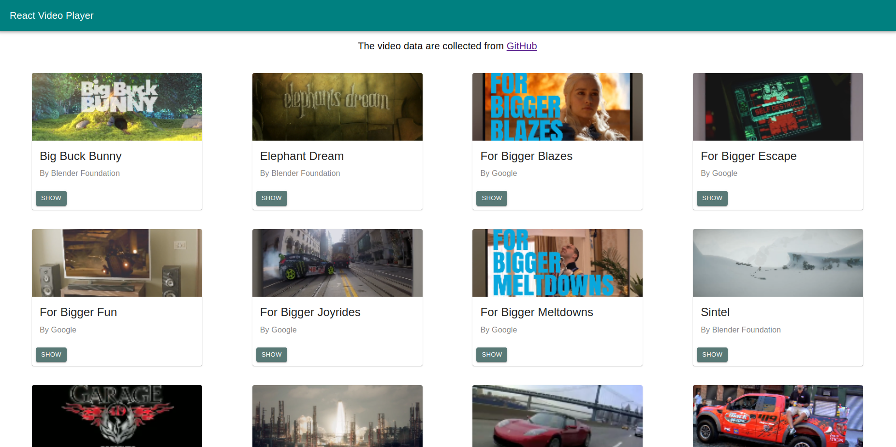
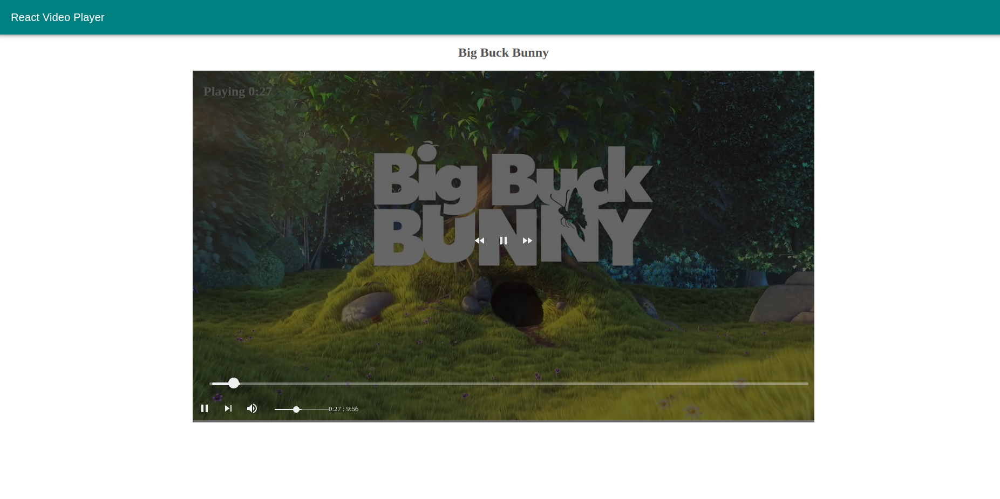

# React video player
Deployed demo site link [Click Here](https://react-video-player-kappa.vercel.app)

## Project Preview
This project consists of the demonstration of how to create custom video player with **ReactJS** and **react-player**. The video playback controller actions are customizable and the styling can be changed depending on developer preferences.

Video control panel supports these functionalities: 
- Play/Pause
- Forward Video
- Rewind Video
- Custom Playback Slider
- Volume Controller
- Mute/UnMute
- Playback time visibility
  
You can customize the project based on requirements and user functionalities.
### Home Page

### Video Player

